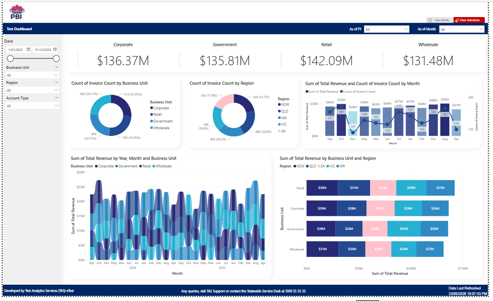
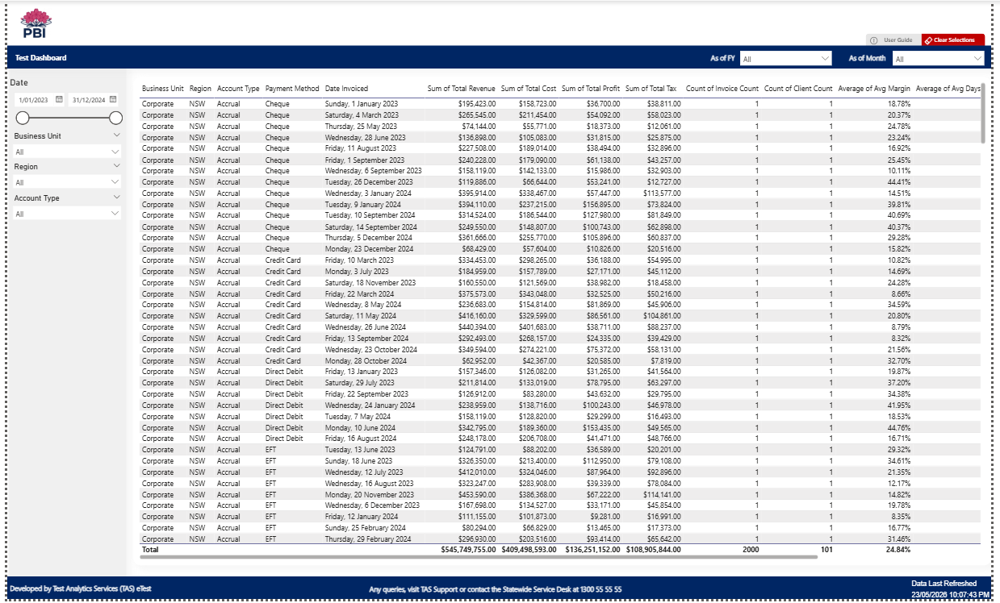

# 🎨 Dashboard Drafter — AI-Powered Power BI Dashboard Generator


**Generate near-complete Power BI dashboards from a single config block.**

Write a config block. Run one command. Get a 90%-complete, 5-page Power BI dashboard — all fields named in Business English, all unused slots hidden, all charts wired and ready to open in Power BI Desktop.

---

## 📺 Demo


---

## 📸 Screenshots

| Summary | Adhoc |
|---------|-------|
|  |  |

| Details | Visual Objects |
|---------|----------------|
|  |  |


---

## 🎯 The Problems This Solves

### The Barista Problem — Design Inconsistency

A team of 5 developers, the same template, but 30 dashboards that all look different. Colours drift. Layouts diverge. The "standard" exists on paper but not in practice.

Dashboard Drafter enforces consistency by architecture. The template never changes. Every generated dashboard is structurally identical.

### The Ping-Pong Problem — Slow Prototyping

Request received Monday. First prototype: the following week. Stakeholder says "that's not what I meant." Another week of revisions.

Dashboard Drafter compresses the feedback loop. Write the config (30 minutes). Generate the dashboard (seconds). Show the stakeholder a working prototype — same day.

### The Binary Skill Problem — Expertise as a Bottleneck

Power BI development requires mastery of DAX, M Query, TMDL, and visual binding internals. This creates a steep skill gap between senior and junior developers.

Dashboard Drafter encodes that expertise into a pipeline. The developer writes a config block. The pipeline handles the rest.

---

## 🏗️ Architecture

```
Config File (/*FACTORY*/ block)
        │
        ▼
  config_parser   ──────►   mquery_generator
        │                          │
        └──────────┬───────────────┘
                   ▼
              factory.py  (orchestrator)
                   │
        ┌──────────┴──────────┐
        ▼                     ▼
  visibility_pipeline    format_pipeline
        │                     │
        └──────────┬──────────┘
                   ▼
            rename_pipeline
                   │
                   ▼
            sort_pipeline
                   │
                   ▼
         Output PBIP (open in Power BI Desktop)
```

The pipeline copies the template, renames all field references across TMDL/DAX/visual JSON in one pass, hides unused slots so charts never see empty columns, and wires sort columns and drillthrough configs automatically.

---

## 🚀 Quick Start

```bash
# Clone
git clone https://github.com/yujiyamane/pbi-dashboard-drafter.git
cd pbi-dashboard-drafter

# Run tests to verify
pip install pytest
pytest --tb=short -q

# Generate sample data
python examples/sample_data_generator.py

# Generate a dashboard
python -c "
from src.config_parser import parse_config
from src.factory import run_factory
from pathlib import Path

config = open('examples/hr_dashboard_config.txt').read()
cfg = parse_config(config)
run_factory(Path('template'), Path('output'), cfg)
print('Dashboard generated in output/HR_Dashboard/')
"
```

Open `output/HR_Dashboard/HR_Dashboard.pbip` in Power BI Desktop.

---

## 📝 Config Block Format

The config lives in a `/*FACTORY ... */` comment block.

```sql
/*FACTORY
TITLE: HR Dashboard
THEME(1:nsw-blue): 1
DB(1:Oracle 2:PostgreSQL 3:Snowflake 4:CSV 5:Excel): 4
SOURCE: examples/sample_hr_data.csv

1.CNT(max5): ①Employee_ID AS "Record Count" ②③④⑤
2.SUM(max10): ①Budget AS "Total Budget"($#,0.00) ②Headcount(#) ③④⑤⑥⑦⑧⑨⑩
3.AVG(max5): ①Rating AS "Avg Rating"(#.0) ②③④⑤
4.DATE: Report_Date AS "Date Reported"
5.KEY(max10): ①Department ②Month_Name AS "Month Name" ③④⑤⑥⑦⑧⑨⑩
6.OTHER: Notes
*/
```

### Slot Types

| Slot | Max | Description |
|------|-----|-------------|
| `CNT` | 5 | COUNT DISTINCT measures. Composite key: `"Col A"+"Col B"` |
| `SUM` | 10 | SUM measures. Format: `Budget($#,0.00)`, `Headcount(#)`, `Rate(#.0)` |
| `AVG` | 5 | AVERAGE measures. Same format options as SUM |
| `DATE` | 1 | Primary date dimension. Use `AS "Display Name"` to rename |
| `KEY` | 10 | Key dimensions — chart axes, slicer values |
| `OTHER` | 10 | Supporting fields — detail table columns |

**Total: 40 columns.** Unused slots are auto-removed from M Query and hidden in the semantic model.

Circle numbers (`①②③...`) mark active slots. Empty circles are unused and disappear automatically.

### Aliasing & Format Strings

```
Source_Column AS "Display Name"           # rename
Source_Column AS "Display Name"($#,0.00)  # rename + currency format
Column_A+"Column B"                       # composite COUNT DISTINCT
Month_Number AS "ORDER Month Name"        # ORDER prefix = sort column (auto-wired)
```

---

## 📁 Template Structure

The template contains 40 pre-built slots across 5 pages:

### Slots

| Category | Count | Template Names |
|----------|-------|----------------|
| SUM Measures | 10 | `SUM_Measure_1` to `SUM_Measure_10` |
| CNT Measures | 5 | `CNT_Measure_1` to `CNT_Measure_5` |
| AVG Measures | 5 | `AVG_Measure_1` to `AVG_Measure_5` |
| Key Dimensions | 10 | `Key_Dim_1` to `Key_Dim_10` |
| Other Fields | 10 | `Other_Field_1` to `Other_Field_10` |
| Date Key | 1 | `DateKey` |

### Pages

| Page | Visible | Purpose |
|------|---------|---------|
| 01 Summary | ✅ | KPI cards, combo chart, Top-N bar, last refresh |
| 02 Adhoc | ✅ | Matrix, slicers, Select Dimension / Select Measure |
| 03 Details | ✅ | Full row-level table, export-ready |
| 04 Visual Objects | ❌ | Pre-built chart library — copy-paste during polish |
| 05 Colour Palette | ❌ | Theme colour swatches for reference |

### Field Parameter Tables

Three Field Parameter tables enable dynamic chart switching via slicers:
- **Select Dimension** — switches the chart axis (Key_Dim slots)
- **Select 2nd Dimension** — secondary axis switcher for cross-tab
- **Select Measure** — switches chart values (SUM and CNT DAX measures)

The pipeline automatically renames `NAMEOF` references, deletes unused rows, and renumbers the index.

---

## ⚙️ Pipeline Steps

| Step | Module | What Happens |
|------|--------|-------------|
| 1 | `factory.py` | Template copied to `output/<ProjectName>/` |
| 2 | `factory.py` | Directories and `.pbip` file renamed to project name |
| 3 | `factory.py` | `definition.pbir` + `.platform` displayName patched |
| 4 | `mquery_generator.py` | M Query written into `Fact.tmdl` partition source |
| 5 | `factory.py` | `sourceColumn` updated to match M Query output column names |
| 6 | `visibility_pipeline.py` | Unused slots marked `isHidden` + `isAvailableInMDX: false` |
| 7 | `format_pipeline.py` | `formatString` applied to active measures and columns |
| 8 | `rename_pipeline.py` | All field references renamed across TMDL, DAX, relationships, Field Parameters, visual JSON |
| 9 | `sort_pipeline.py` | ORDER columns wired to `sortByColumn`; ORDER columns hidden |
| 10 | `visibility_pipeline.py` | Unused-slot entries removed from visual projections and drillthrough configs |

---

## 🗄️ Supported Data Sources

| Source | DB Code | M Query Pattern |
|--------|---------|-----------------|
| CSV | 4 | `Csv.Document(File.Contents(...))` |
| Excel | 5 | `Excel.Workbook(File.Contents(...))` |
| Oracle | 1 | `Oracle.Database([Query=...])` |
| PostgreSQL | 2 | `Value.NativeQuery(PostgreSQL.Database(...), ..., [EnableFolding=true])` |
| Snowflake | 3 | `Value.NativeQuery(Snowflake.Databases(...), ..., [EnableFolding=true])` |

---

## ⚠️ Limitations

- **Single fact table only.** Multi-fact or star schema models are not supported.
- **Single date dimension.** If your source has multiple date columns, designate one as the DATE slot; put others in OTHER or KEY.
- **40-column maximum.** SUM ×10, CNT ×5, AVG ×5, Key ×10, Other ×10, DateKey ×1.
- **Initial generation only.** Dashboard Drafter generates a 90% complete dashboard. The remaining polish is done manually in Power BI Desktop.
- **No `EnableFolding` on Oracle.** Oracle executes SQL directly; post-query Power Query steps will not fold.

---

## 🧪 Test Coverage

**342 TDD tests. Every bug is permanently fixed by a failing test first.**

| Test File | What It Covers |
|-----------|---------------|
| `test_config_parser.py` | Config block parsing, slot extraction, alias resolution, composite keys |
| `test_mquery_generator.py` | M Query generation for all 5 source types |
| `test_rename_pipeline.py` | TMDL rename, DAX refs, relationship rename, visual JSON rename, Field Parameter NAMEOF + index renumbering |
| `test_visibility_pipeline.py` | Hidden column detection, TMDL visibility flags, projection array purge, drillthrough filter purge |
| `test_format_pipeline.py` | Format string application ($, #, #.0, #.00, %) |
| `test_sort_pipeline.py` | ORDER column detection, sortByColumn wiring, ORDER column hiding |
| `test_factory.py` | Full E2E pipeline: M Query, sourceColumn, rename, visibility, format, sort, Field Parameter E2E |

```bash
pytest --tb=short -q
# 342 passed in ~75s
```

---

## 🗺️ Roadmap

- [ ] SQL sources — Oracle, PostgreSQL, Snowflake tested end-to-end on live databases
- [ ] CLI — `dashboard-drafter generate config.txt --output ./output`
- [ ] Multi-template — different page layouts per use case (operational vs. executive)
- [ ] Theme swap — swap the colour theme without regenerating the full dashboard
- [ ] CI/CD integration — automated dashboard generation and deployment pipeline

---

## 📄 License

MIT — see [LICENSE](LICENSE).

---

## 🙏 Acknowledgements

Built with:
- [Python 3.13](https://www.python.org/)
- [pytest](https://docs.pytest.org/) — TDD from day one
- [Power BI PBIP format](https://learn.microsoft.com/en-us/power-bi/developer/projects/projects-overview) — the open, git-friendly Power BI project format that makes this possible
